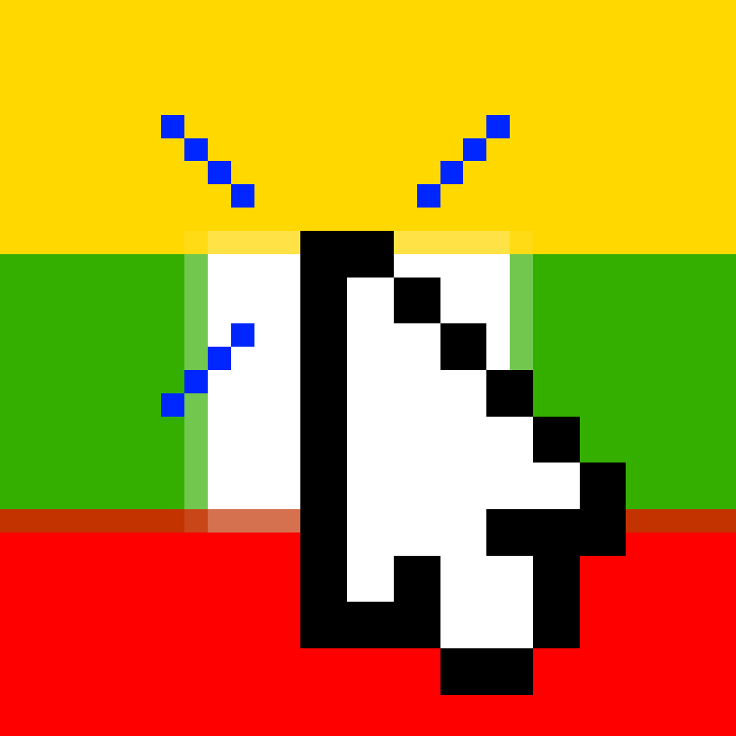

<p align="center">
    
</p>
<h1 align="center">
    Pikseliuok
</h1>
<p align="center">
    <a href="https://discord.gg/jCw8vg93xH"></a>
    &nbsp;
    <a href="https://www.instagram.com/pikseliuok/"></a>
</p>

A Next.js landing page for Pikseliuok, an r/place inspired collaborative pixel art project. This landing page showcases the final canvas, statistics, and information about the project.

## Installation

1. Clone the repository:
   ```bash
   git clone git@github.com:Pikseliuok/pikseliuok-landing.git
    cd pikseliuok-landing
   ```
2. Install dependencies:
   ```bash
   npm install
   # or
   yarn install
   # or
   pnpm install
   ```
3. Run the development server:
   ```bash
   npm run dev
   # or
   yarn dev
   # or
   pnpm dev
   ```
4. Open [http://localhost:3000](http://localhost:3000) in your browser.
